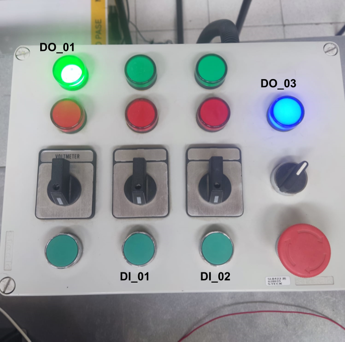
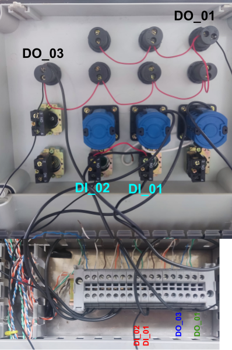
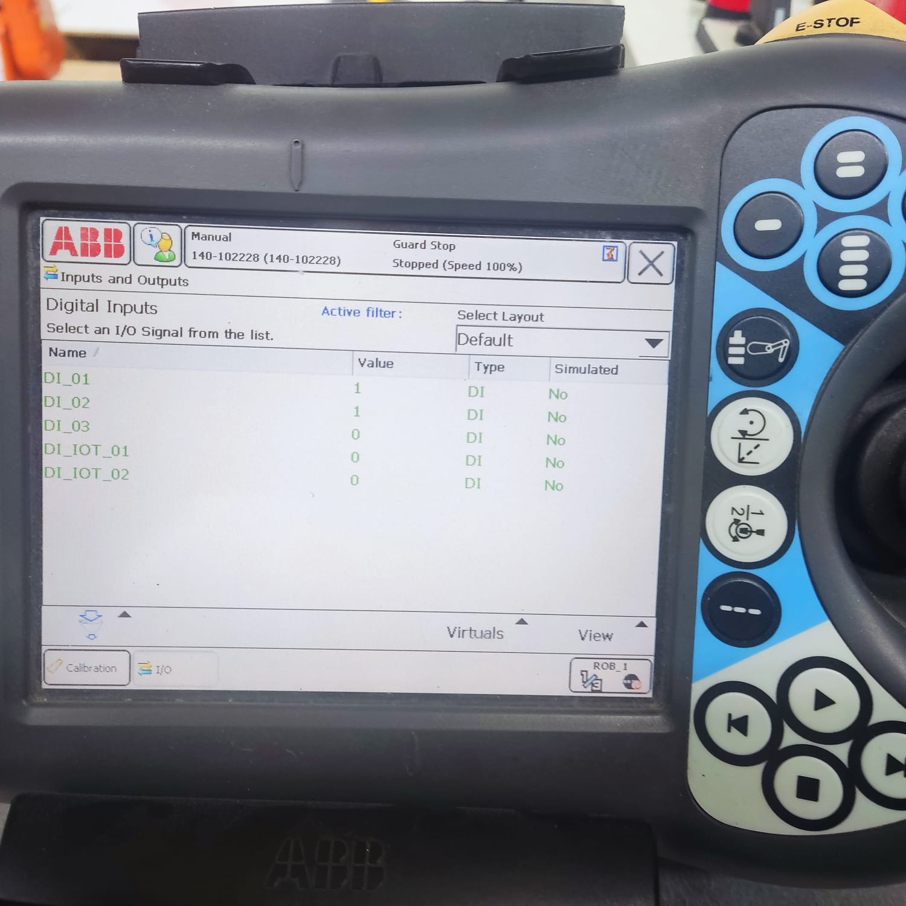
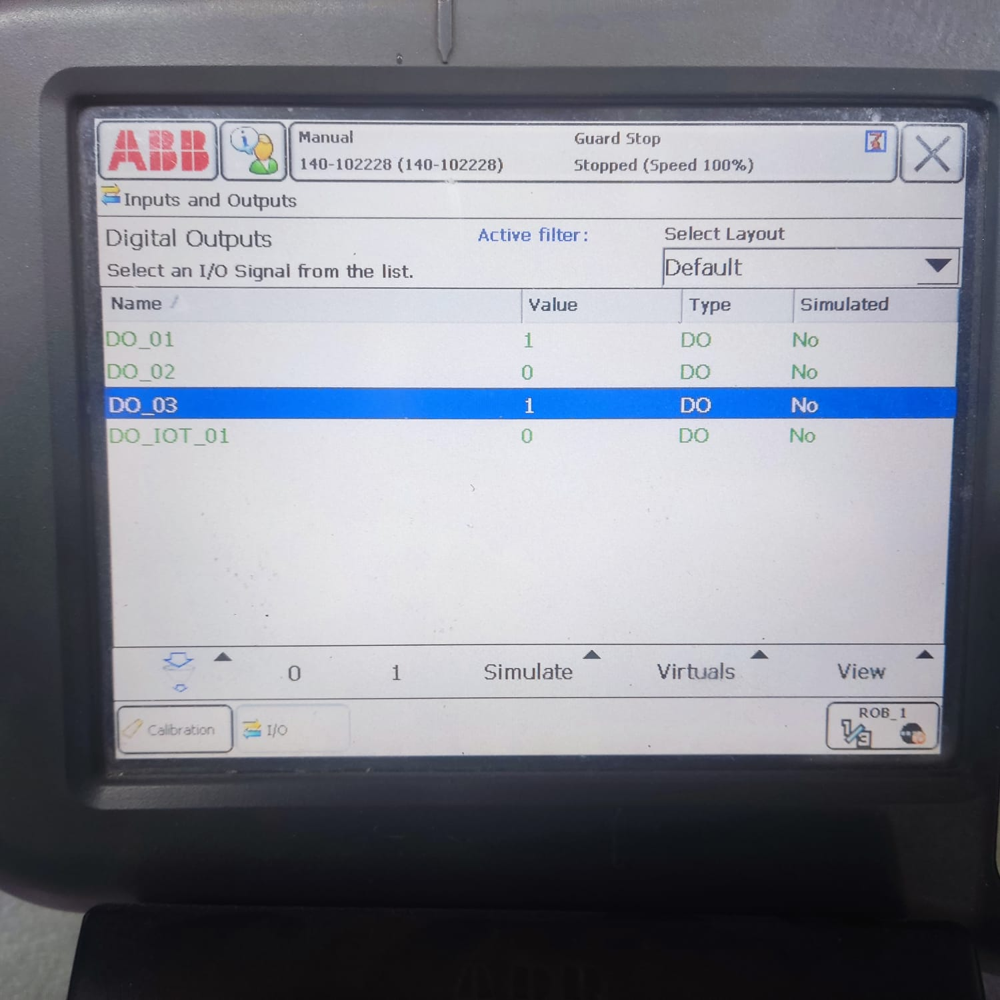

# Robotica_2023-2_Lab2
## Integrantes

### Wilfer Armando Fiquitiva Mendez.
### Johan Leonardo Castellanos Ruiz.
### Juan Pablo Cardenas Higuera.

**Introducción**
En este informe, se presenta el trabajo realizado en el laboratorio para controlar un robot industrial utilizando señales digitales de entrada y salida. El objetivo principal de esta práctica fue configurar el robot para responder a dos señales digitales de entrada y controlar dos salidas digitales, llevando a cabo tareas específicas en función de las señales recibidas.


### 1. Descripcion de la solucion planteada

**Revisión y Caracterización Inicial**
Iniciamos la práctica revisando y comprendiendo en profundidad el funcionamiento de las señales digitales de entrada y salida en el robot industrial. Verificamos que los paneles de mando estuvieran correctamente configurados y listos para su uso. Por lo que se realizó el cableado respectivo de la consola de entradas y salidas digitales




Adaptamos el programa del anterior laboratorio en lenguaje RAPID que permita la configuración de dos entradas digitales y dos salidas digitales. Nos aseguramos de que estas entradas y salidas estuvieran mapeadas y configuradas adecuadamente en el código.

Programamos la primera señal de entrada1(DI_01) para iniciar una rutina de escritura en una superficie específica. Utilizamos las salidas digitales para controlar el brazo del robot y encender una luz de indicación al inicio de la rutina.
Al finalizar la rutina, aseguramos que el brazo del robot regresara a su posición de inicio, donde todos los ángulos articulares se establecieran en 0 grados.

Programamos la segunda señal de entrada (DI_02) para posicionar el brazo del robot en una pose de mantenimiento. Esta pose permitía la instalación o desinstalación de una herramienta y, al mismo tiempo, apagaba la luz de indicación.


Utilizamos botones en el mando de señales digitales para controlar la transición entre las rutinas. Establecimos un botón para iniciar la primera rutina (DO_01) y otro para activar la segunda rutina (DO_03). El código respondía adecuadamente a estos botones y ejecutaba las transiciones de manera segura.




### 2. Codigo en RAPID del modulo utilizado para el desarrollo de la practica.
```rapid
MODULE Module1
    TASK PERS tooldata Punta:=[TRUE,[[60.4006,57.6025,171.79],[0.906308,0.000000009,0.422618,-0.000000018]],[0.3,[0,0,1],[1,0,0,0],0,0,0]];
    PERS tooldata Tregaskiss22deg:=[TRUE,[[148.62,0.25,326.31],[0.833900724,0,0.551914471,0]],[1,[0,0,100],[1,0,0,0],0,0,0]];
    TASK PERS wobjdata WOtortaplana:=[FALSE,TRUE,"",[[524.053,168.37,21],[0.932464,0.0199095,0.00570174,0.36067]],[[0,0,0],[1,0,0,0]]];
    TASK PERS wobjdata WO_INCLINADO:=[FALSE,TRUE,"",[[-184.065336567,453.534317049,0],[0.681155441,0.25853718,-0.282143822,0.624163965]],[[0,0,0],[1,0,0,0]]];
    PERS wobjdata WoCuadrado:=[FALSE,TRUE,"",[[614.276136575,138.113342602,400],[0,0.382681799,0.923880209,0]],[[0,0,0],[1,0,0,0]]];
    CONST robtarget Aprox_plana:=[[498.683974881,327.129981159,418.320307368],[-0.000000079,0.000000029,1,0.000000004],[0,-1,0,0],[9E+09,9E+09,9E+09,9E+09,9E+09,9E+09]];
    CONST robtarget Target_80:=[[188.963680444,215.825253272,0],[0,0.382683432,0.923879533,0],[0,-2,1,0],[9E+09,9E+09,9E+09,9E+09,9E+09,9E+09]];
    CONST robtarget Target_90:=[[148.963356951,204.670643757,0],[0,0.382683432,0.923879533,0],[0,-2,1,0],[9E+09,9E+09,9E+09,9E+09,9E+09,9E+09]];
    CONST robtarget Target_100:=[[188.963680469,192.123033967,0],[0,0.382683432,0.923879533,0],[0,-2,1,0],[9E+09,9E+09,9E+09,9E+09,9E+09,9E+09]];
    CONST robtarget Target_110:=[[148.963356976,180.456479142,0],[0,0.382683432,0.923879533,0],[0,-2,1,0],[9E+09,9E+09,9E+09,9E+09,9E+09,9E+09]];
    CONST robtarget Target_120:=[[188.962973386,169.158327034,0],[0,0.382683432,0.923879533,0],[0,-2,1,0],[9E+09,9E+09,9E+09,9E+09,9E+09,9E+09]];
    CONST robtarget Target_130:=[[188.962973386,169.158327034,80],[0,0.382683432,0.923879533,0],[0,-1,1,0],[9E+09,9E+09,9E+09,9E+09,9E+09,9E+09]];
    CONST robtarget Target_140:=[[188.963680501,161.979071885,0],[0,0.382683432,0.923879533,0],[0,-2,1,0],[9E+09,9E+09,9E+09,9E+09,9E+09,9E+09]];
    CONST robtarget Target_150:=[[148.963356996,161.978364736,0],[0,0.382683432,0.923879533,0],[0,-2,1,0],[9E+09,9E+09,9E+09,9E+09,9E+09,9E+09]];
    CONST robtarget Target_160:=[[148.963356996,161.978364736,80],[0,0.382683432,0.923879533,0],[0,-1,1,0],[9E+09,9E+09,9E+09,9E+09,9E+09,9E+09]];
    CONST robtarget Target_170:=[[188.963680515,148.132506896,0],[0,0.382683432,0.923879533,0],[0,-2,1,0],[9E+09,9E+09,9E+09,9E+09,9E+09,9E+09]];
    CONST robtarget Target_180:=[[148.96335701,148.133213961,0],[0,0.382683432,0.923879533,0],[0,-2,1,0],[9E+09,9E+09,9E+09,9E+09,9E+09,9E+09]];
    CONST robtarget Target_190:=[[148.96335703,129.158710594,0],[0,0.382683432,0.923879533,0],[0,-2,1,0],[9E+09,9E+09,9E+09,9E+09,9E+09,9E+09]];
    CONST robtarget Target_200:=[[148.96335703,129.158710594,80],[0,0.382683432,0.923879533,0],[0,-2,1,0],[9E+09,9E+09,9E+09,9E+09,9E+09,9E+09]];
    CONST robtarget Target_210:=[[188.962973456,103.004245014,0],[0,0.382683432,0.923879533,0],[0,-2,1,0],[9E+09,9E+09,9E+09,9E+09,9E+09,9E+09]];
    CONST robtarget Target_220:=[[188.963680542,122.491400796,0],[0,0.382683432,0.923879533,0],[0,-2,1,0],[9E+09,9E+09,9E+09,9E+09,9E+09,9E+09]];
    CONST robtarget Target_230:=[[148.963357037,122.492107861,0],[0,0.382683432,0.923879533,0],[0,-2,1,0],[9E+09,9E+09,9E+09,9E+09,9E+09,9E+09]];
    CONST robtarget Target_240:=[[148.963357037,122.492107861,80],[0,0.382683432,0.923879533,0],[0,-2,1,0],[9E+09,9E+09,9E+09,9E+09,9E+09,9E+09]];
    CONST robtarget Target_250:=[[168.963165236,122.492107882,0],[0,0.382683432,0.923879533,0],[0,-2,1,0],[9E+09,9E+09,9E+09,9E+09,9E+09,9E+09]];
    CONST robtarget Target_260:=[[170.501829612,103.004244994,0],[0,0.382683432,0.923879533,0],[0,-2,1,0],[9E+09,9E+09,9E+09,9E+09,9E+09,9E+09]];
    CONST robtarget Target_270:=[[170.501829612,103.004244994,80],[0,0.382683432,0.923879533,0],[0,-1,1,0],[9E+09,9E+09,9E+09,9E+09,9E+09,9E+09]];
    CONST robtarget Target_280:=[[188.963680594,73.261212477,0],[0,0.382683432,0.923879533,0],[0,-2,1,0],[9E+09,9E+09,9E+09,9E+09,9E+09,9E+09]];
    CONST robtarget Target_290:=[[188.96368057,95.824989864,0],[0,0.382683432,0.923879533,0],[0,-2,1,0],[9E+09,9E+09,9E+09,9E+09,9E+09,9E+09]];
    CONST robtarget Target_300:=[[148.964064172,95.824989822,0],[0,0.382683432,0.923879533,0],[0,-2,1,0],[9E+09,9E+09,9E+09,9E+09,9E+09,9E+09]];
    CONST robtarget Target_310:=[[148.963357089,73.260505328,0],[0,0.382683432,0.923879533,0],[0,-2,1,0],[9E+09,9E+09,9E+09,9E+09,9E+09,9E+09]];
    CONST robtarget Target_320:=[[148.963357089,73.260505328,80],[0,0.382683432,0.923879533,0],[0,-2,1,0],[9E+09,9E+09,9E+09,9E+09,9E+09,9E+09]];
    CONST robtarget Target_330:=[[168.963872371,95.824989843,0],[0,0.382683432,0.923879533,0],[0,-2,1,0],[9E+09,9E+09,9E+09,9E+09,9E+09,9E+09]];
    CONST robtarget Target_340:=[[170.501829644,73.26050535,0],[0,0.382683432,0.923879533,0],[0,-2,1,0],[9E+09,9E+09,9E+09,9E+09,9E+09,9E+09]];
    CONST robtarget Target_350:=[[170.501829644,73.26050535,80],[0,0.382683432,0.923879533,0],[0,-1,1,0],[9E+09,9E+09,9E+09,9E+09,9E+09,9E+09]];
    CONST robtarget Target_360:=[[148.963357096,66.081957285,0],[0,0.382683432,0.923879533,0],[0,-2,1,0],[9E+09,9E+09,9E+09,9E+09,9E+09,9E+09]];
    CONST robtarget Target_370:=[[188.963680601,66.08125022,0],[0,0.382683432,0.923879533,0],[0,-2,1,0],[9E+09,9E+09,9E+09,9E+09,9E+09,9E+09]];
    CONST robtarget Target_380:=[[188.418501291,49.013813842,0],[0,0.382683432,0.923879533,0],[0,-2,1,0],[9E+09,9E+09,9E+09,9E+09,9E+09,9E+09]];
    CONST robtarget Target_390:=[[184.810135392,43.120078817,0],[0,0.382683432,0.923879533,0],[0,-2,1,0],[9E+09,9E+09,9E+09,9E+09,9E+09,9E+09]];
    CONST robtarget Target_400:=[[178.266569242,40.953503633,0],[0,0.382683432,0.923879533,0],[0,-2,1,0],[9E+09,9E+09,9E+09,9E+09,9E+09,9E+09]];
    CONST robtarget Target_410:=[[169.612289342,45.379284967,0],[0,0.382683432,0.923879533,0],[0,-2,1,0],[9E+09,9E+09,9E+09,9E+09,9E+09,9E+09]];
    CONST robtarget Target_420:=[[167.424500951,55.135944332,0],[0,0.382683432,0.923879533,0],[0,-2,1,0],[9E+09,9E+09,9E+09,9E+09,9E+09,9E+09]];
    CONST robtarget Target_430:=[[167.42520805,62.491976176,0],[0,0.382683432,0.923879533,0],[0,-2,1,0],[9E+09,9E+09,9E+09,9E+09,9E+09,9E+09]];
    CONST robtarget Target_440:=[[148.963357123,40.440851186,0],[0,0.382683432,0.923879533,0],[0,-2,1,0],[9E+09,9E+09,9E+09,9E+09,9E+09,9E+09]];
    CONST robtarget Target_450:=[[148.963357123,40.440851186,80],[0,0.382683432,0.923879533,0],[0,-2,1,0],[9E+09,9E+09,9E+09,9E+09,9E+09,9E+09]];
    CONST robtarget Target_460:=[[90.306021007,221.20280024,0],[0,0.382683432,0.923879533,0],[0,-2,1,0],[9E+09,9E+09,9E+09,9E+09,9E+09,9E+09]];
    CONST robtarget Target_470:=[[87.030702401,216.822980834,0],[0,0.382683432,0.923879533,0],[0,-2,1,0],[9E+09,9E+09,9E+09,9E+09,9E+09,9E+09]];
    CONST robtarget Target_480:=[[85.690027949,211.555035312,0],[0,0.382683432,0.923879533,0],[0,-2,1,0],[9E+09,9E+09,9E+09,9E+09,9E+09,9E+09]];
    CONST robtarget Target_490:=[[90.192176834,203.541394166,0],[0,0.382683432,0.923879533,0],[0,-2,1,0],[9E+09,9E+09,9E+09,9E+09,9E+09,9E+09]];
    CONST robtarget Target_500:=[[99.704884362,202.228296883,0],[0,0.382683432,0.923879533,0],[0,-2,1,0],[9E+09,9E+09,9E+09,9E+09,9E+09,9E+09]];
    CONST robtarget Target_510:=[[113.210623883,202.228296897,0],[0,0.382683432,0.923879533,0],[0,-2,1,0],[9E+09,9E+09,9E+09,9E+09,9E+09,9E+09]];
    CONST robtarget Target_520:=[[126.716363404,202.228296912,0],[0,0.382683432,0.923879533,0],[0,-2,1,0],[9E+09,9E+09,9E+09,9E+09,9E+09,9E+09]];
    CONST robtarget Target_530:=[[126.716363404,202.228296912,80],[0,0.382683432,0.923879533,0],[0,-1,1,0],[9E+09,9E+09,9E+09,9E+09,9E+09,9E+09]];
    CONST robtarget Target_540:=[[106.539778518,194.023029801,0],[0,0.382683432,0.923879533,0],[0,-2,1,0],[9E+09,9E+09,9E+09,9E+09,9E+09,9E+09]];
    CONST robtarget Target_550:=[[91.708920896,187.840088091,0],[0,0.382683432,0.923879533,0],[0,-2,1,0],[9E+09,9E+09,9E+09,9E+09,9E+09,9E+09]];
    CONST robtarget Target_560:=[[85.690735097,172.933570031,0],[0,0.382683432,0.923879533,0],[0,-2,1,0],[9E+09,9E+09,9E+09,9E+09,9E+09,9E+09]];
    CONST robtarget Target_570:=[[91.826300653,158.053922041,0],[0,0.382683432,0.923879533,0],[0,-2,1,0],[9E+09,9E+09,9E+09,9E+09,9E+09,9E+09]];
    CONST robtarget Target_580:=[[106.7314045,151.972096631,0],[0,0.382683432,0.923879533,0],[0,-2,1,0],[9E+09,9E+09,9E+09,9E+09,9E+09,9E+09]];
    CONST robtarget Target_590:=[[121.741867244,158.156452555,0],[0,0.382683432,0.923879533,0],[0,-2,1,0],[9E+09,9E+09,9E+09,9E+09,9E+09,9E+09]];
    CONST robtarget Target_600:=[[127.741668267,173.253889447,0],[0,0.382683432,0.923879533,0],[0,-2,1,0],[9E+09,9E+09,9E+09,9E+09,9E+09,9E+09]];
    CONST robtarget Target_610:=[[121.507107762,188.069897826,0],[0,0.382683432,0.923879533,0],[0,-2,1,0],[9E+09,9E+09,9E+09,9E+09,9E+09,9E+09]];
    CONST robtarget Target_620:=[[106.539778518,194.023029801,0],[0,0.382683432,0.923879533,0],[0,-2,1,0],[9E+09,9E+09,9E+09,9E+09,9E+09,9E+09]];
    CONST robtarget Target_630:=[[106.539778518,194.023029801,80],[0,0.382683432,0.923879533,0],[0,-2,1,0],[9E+09,9E+09,9E+09,9E+09,9E+09,9E+09]];
    CONST robtarget Target_640:=[[126.715656358,143.766829563,0],[0,0.382683432,0.923879533,0],[0,-2,1,0],[9E+09,9E+09,9E+09,9E+09,9E+09,9E+09]];
    CONST robtarget Target_650:=[[86.71603996,143.766829521,0],[0,0.382683432,0.923879533,0],[0,-2,1,0],[9E+09,9E+09,9E+09,9E+09,9E+09,9E+09]];
    CONST robtarget Target_660:=[[86.71603996,143.766829521,80],[0,0.382683432,0.923879533,0],[0,-2,1,0],[9E+09,9E+09,9E+09,9E+09,9E+09,9E+09]];
    CONST robtarget Target_670:=[[106.715848159,143.766829542,0],[0,0.382683432,0.923879533,0],[0,-2,1,0],[9E+09,9E+09,9E+09,9E+09,9E+09,9E+09]];
    CONST robtarget Target_680:=[[106.715848188,116.075113778,0],[0,0.382683432,0.923879533,0],[0,-2,1,0],[9E+09,9E+09,9E+09,9E+09,9E+09,9E+09]];
    CONST robtarget Target_690:=[[106.715848188,116.075113778,80],[0,0.382683432,0.923879533,0],[0,-2,1,0],[9E+09,9E+09,9E+09,9E+09,9E+09,9E+09]];
    CONST robtarget Target_700:=[[126.716363494,116.074406692,0],[0,0.382683432,0.923879533,0],[0,-2,1,0],[9E+09,9E+09,9E+09,9E+09,9E+09,9E+09]];
    CONST robtarget Target_710:=[[86.715332882,116.07440665,0],[0,0.382683432,0.923879533,0],[0,-2,1,0],[9E+09,9E+09,9E+09,9E+09,9E+09,9E+09]];
    CONST robtarget Target_720:=[[86.715332882,116.07440665,80],[0,0.382683432,0.923879533,0],[0,-2,1,0],[9E+09,9E+09,9E+09,9E+09,9E+09,9E+09]];
    CONST robtarget Target_730:=[[86.716039997,108.8951515,0],[0,0.382683432,0.923879533,0],[0,-2,1,0],[9E+09,9E+09,9E+09,9E+09,9E+09,9E+09]];
    CONST robtarget Target_740:=[[126.716363522,89.40799576,0],[0,0.382683432,0.923879533,0],[0,-2,1,0],[9E+09,9E+09,9E+09,9E+09,9E+09,9E+09]];
    CONST robtarget Target_750:=[[86.716040036,70.946144768,0],[0,0.382683432,0.923879533,0],[0,-2,1,0],[9E+09,9E+09,9E+09,9E+09,9E+09,9E+09]];
    CONST robtarget Target_760:=[[86.716040036,70.946144768,80],[0,0.382683432,0.923879533,0],[0,-2,1,0],[9E+09,9E+09,9E+09,9E+09,9E+09,9E+09]];
    CONST robtarget Target_770:=[[99.53588595,98.895247414,0],[0,0.382683432,0.923879533,0],[0,-2,1,0],[9E+09,9E+09,9E+09,9E+09,9E+09,9E+09]];
    CONST robtarget Target_780:=[[118.919097046,89.704273493,0],[0,0.382683432,0.923879533,0],[0,-2,1,0],[9E+09,9E+09,9E+09,9E+09,9E+09,9E+09]];
    CONST robtarget Target_790:=[[99.535885969,80.762201118,0],[0,0.382683432,0.923879533,0],[0,-2,1,0],[9E+09,9E+09,9E+09,9E+09,9E+09,9E+09]];
    CONST robtarget Target_800:=[[99.53588595,98.895247414,0],[0,0.382683432,0.923879533,0],[0,-2,1,0],[9E+09,9E+09,9E+09,9E+09,9E+09,9E+09]];
    CONST robtarget Target_810:=[[99.53588595,98.895247414,80],[0,0.382683432,0.923879533,0],[0,-2,1,0],[9E+09,9E+09,9E+09,9E+09,9E+09,9E+09]];
    CONST robtarget Target_820:=[[86.715332937,63.766889618,0],[0,0.382683432,0.923879533,0],[0,-2,1,0],[9E+09,9E+09,9E+09,9E+09,9E+09,9E+09]];
    CONST robtarget Target_830:=[[126.715656443,63.013820938,0],[0,0.382683432,0.923879533,0],[0,-2,1,0],[9E+09,9E+09,9E+09,9E+09,9E+09,9E+09]];
    CONST robtarget Target_840:=[[86.716040076,32.997138035,0],[0,0.382683432,0.923879533,0],[0,-2,1,0],[9E+09,9E+09,9E+09,9E+09,9E+09,9E+09]];
    CONST robtarget Target_850:=[[126.715656474,32.997138077,0],[0,0.382683432,0.923879533,0],[0,-2,1,0],[9E+09,9E+09,9E+09,9E+09,9E+09,9E+09]];
    CONST robtarget Target_860:=[[126.715656474,32.997138077,80],[0,0.382683432,0.923879533,0],[0,-2,1,0],[9E+09,9E+09,9E+09,9E+09,9E+09,9E+09]];
    CONST robtarget Target_870:=[[31.215228656,190.433048594,0],[0,0.382683432,0.923879533,0],[0,-2,1,0],[9E+09,9E+09,9E+09,9E+09,9E+09,9E+09]];
    CONST robtarget Target_880:=[[27.93991005,186.053229188,0],[0,0.382683432,0.923879533,0],[0,-2,1,0],[9E+09,9E+09,9E+09,9E+09,9E+09,9E+09]];
    CONST robtarget Target_890:=[[26.599942705,180.785990774,0],[0,0.382683432,0.923879533,0],[0,-2,1,0],[9E+09,9E+09,9E+09,9E+09,9E+09,9E+09]];
    CONST robtarget Target_900:=[[31.102091589,172.772349627,0],[0,0.382683432,0.923879533,0],[0,-2,1,0],[9E+09,9E+09,9E+09,9E+09,9E+09,9E+09]];
    CONST robtarget Target_910:=[[40.614799118,171.459252345,0],[0,0.382683432,0.923879533,0],[0,-2,1,0],[9E+09,9E+09,9E+09,9E+09,9E+09,9E+09]];
    CONST robtarget Target_920:=[[54.120538639,171.459252359,0],[0,0.382683432,0.923879533,0],[0,-2,1,0],[9E+09,9E+09,9E+09,9E+09,9E+09,9E+09]];
    CONST robtarget Target_930:=[[67.626278159,171.459252373,0],[0,0.382683432,0.923879533,0],[0,-2,1,0],[9E+09,9E+09,9E+09,9E+09,9E+09,9E+09]];
    CONST robtarget Target_940:=[[67.626278159,171.459252373,80],[0,0.382683432,0.923879533,0],[0,-2,1,0],[9E+09,9E+09,9E+09,9E+09,9E+09,9E+09]];
    CONST robtarget Target_950:=[[67.625571063,161.202668512,0],[0,0.382683432,0.923879533,0],[0,-2,1,0],[9E+09,9E+09,9E+09,9E+09,9E+09,9E+09]];
    CONST robtarget Target_960:=[[55.546773027,161.202668499,0],[0,0.382683432,0.923879533,0],[0,-2,1,0],[9E+09,9E+09,9E+09,9E+09,9E+09,9E+09]];
    CONST robtarget Target_970:=[[43.466560777,161.202668487,0],[0,0.382683432,0.923879533,0],[0,-2,1,0],[9E+09,9E+09,9E+09,9E+09,9E+09,9E+09]];
    CONST robtarget Target_980:=[[35.037847946,160.489904842,0],[0,0.382683432,0.923879533,0],[0,-2,1,0],[9E+09,9E+09,9E+09,9E+09,9E+09,9E+09]];
    CONST robtarget Target_990:=[[28.698635658,155.706327461,0],[0,0.382683432,0.923879533,0],[0,-2,1,0],[9E+09,9E+09,9E+09,9E+09,9E+09,9E+09]];
    CONST robtarget Target_1000:=[[26.600649846,147.989671156,0],[0,0.382683432,0.923879533,0],[0,-2,1,0],[9E+09,9E+09,9E+09,9E+09,9E+09,9E+09]];
    CONST robtarget Target_1010:=[[31.970418753,137.920470597,0],[0,0.382683432,0.923879533,0],[0,-2,1,0],[9E+09,9E+09,9E+09,9E+09,9E+09,9E+09]];
    CONST robtarget Target_1020:=[[43.466560804,135.561562387,0],[0,0.382683432,0.923879533,0],[0,-2,1,0],[9E+09,9E+09,9E+09,9E+09,9E+09,9E+09]];
    CONST robtarget Target_1030:=[[55.546773054,135.5615624,0],[0,0.382683432,0.923879533,0],[0,-2,1,0],[9E+09,9E+09,9E+09,9E+09,9E+09,9E+09]];
    CONST robtarget Target_1040:=[[67.62557109,135.561562413,0],[0,0.382683432,0.923879533,0],[0,-2,1,0],[9E+09,9E+09,9E+09,9E+09,9E+09,9E+09]];
    CONST robtarget Target_1050:=[[67.62557109,135.561562413,80],[0,0.382683432,0.923879533,0],[0,-2,1,0],[9E+09,9E+09,9E+09,9E+09,9E+09,9E+09]];
    CONST robtarget Target_1060:=[[27.625247593,128.382307221,0],[0,0.382683432,0.923879533,0],[0,-2,1,0],[9E+09,9E+09,9E+09,9E+09,9E+09,9E+09]];
    CONST robtarget Target_1070:=[[67.626278224,109.407803897,0],[0,0.382683432,0.923879533,0],[0,-2,1,0],[9E+09,9E+09,9E+09,9E+09,9E+09,9E+09]];
    CONST robtarget Target_1080:=[[27.625247633,90.433300488,0],[0,0.382683432,0.923879533,0],[0,-2,1,0],[9E+09,9E+09,9E+09,9E+09,9E+09,9E+09]];
    CONST robtarget Target_1090:=[[27.625247633,90.433300488,80],[0,0.382683432,0.923879533,0],[0,-2,1,0],[9E+09,9E+09,9E+09,9E+09,9E+09,9E+09]];
    CONST robtarget Target_1100:=[[40.44650776,118.382403135,0],[0,0.382683432,0.923879533,0],[0,-2,1,0],[9E+09,9E+09,9E+09,9E+09,9E+09,9E+09]];
    CONST robtarget Target_1110:=[[59.829718855,109.191429214,0],[0,0.382683432,0.923879533,0],[0,-2,1,0],[9E+09,9E+09,9E+09,9E+09,9E+09,9E+09]];
    CONST robtarget Target_1120:=[[40.446507779,100.249356838,0],[0,0.382683432,0.923879533,0],[0,-2,1,0],[9E+09,9E+09,9E+09,9E+09,9E+09,9E+09]];
    CONST robtarget Target_1130:=[[40.44650776,118.382403135,0],[0,0.382683432,0.923879533,0],[0,-2,1,0],[9E+09,9E+09,9E+09,9E+09,9E+09,9E+09]];
    CONST robtarget Target_1140:=[[40.44650776,118.382403135,80],[0,0.382683432,0.923879533,0],[0,-2,1,0],[9E+09,9E+09,9E+09,9E+09,9E+09,9E+09]];
    CONST robtarget Target_1150:=[[27.625954747,83.254045339,0],[0,0.382683432,0.923879533,0],[0,-2,1,0],[9E+09,9E+09,9E+09,9E+09,9E+09,9E+09]];
    CONST robtarget Target_1160:=[[67.625571145,82.877864573,0],[0,0.382683432,0.923879533,0],[0,-2,1,0],[9E+09,9E+09,9E+09,9E+09,9E+09,9E+09]];
    CONST robtarget Target_1170:=[[27.625954779,52.485000863,0],[0,0.382683432,0.923879533,0],[0,-2,1,0],[9E+09,9E+09,9E+09,9E+09,9E+09,9E+09]];
    CONST robtarget Target_1180:=[[67.625571177,52.485000904,0],[0,0.382683432,0.923879533,0],[0,-2,1,0],[9E+09,9E+09,9E+09,9E+09,9E+09,9E+09]];
    CONST robtarget Target_1190:=[[67.625571177,52.485000904,80],[0,0.382683432,0.923879533,0],[0,-2,1,0],[9E+09,9E+09,9E+09,9E+09,9E+09,9E+09]];
    CONST robtarget Target_1220:=[[67.625549429,52.485034361,322.442309276],[-0.000000037,0.38268345,0.923879525,0.000000048],[0,-1,0,0],[9E+09,9E+09,9E+09,9E+09,9E+09,9E+09]];
    CONST jointtarget home:=[[0,0,0,0,0,0],[9E+09,9E+09,9E+09,9E+09,9E+09,9E+09]];
    CONST jointtarget Pos_manten:=[[90,10,-10,0,0,0],[9E+09,9E+09,9E+09,9E+09,9E+09,9E+09]];
    PERS robtarget Target_x:=[[-2.52439E-5,577.513,500],[0.5,-0.5,0.5,0.5],[1,0,0,0],[9E+9,9E+9,9E+9,9E+9,9E+9,9E+9]];
    
    PROC main()
        WHILE TRUE DO
            TPErase;
            TPWrite "EN EL MAIN";
            IF DI_01 =1 THEN
                SetDO DO_01,1;
                Path_10;
                Homming;
                SetDO DO_01,0;
            ENDIF
            IF DI_03 =1 THEN
                SetDO DO_02,1;
                Manten;
                WaitDI DI_03,1;
                Homming;
                SetDO DO_02,0;
            ENDIF
        endwhile
    ENDPROC 
    PROC Homming()
        TPWrite "LLendo a casita";
        Target_x:=CRobT(\Tool:=tool0 \WObj:=wobj0);
        Target_x.trans.z:=500;
        MoveJ Target_x,v500,fine,tool0\WObj:=wobj0;
        MoveAbsJ home, v500, fine, tool0;
    ENDPROC
    PROC Manten()
        TPWrite "Posicion de mantenimiento";
        Target_x:=CRobT(\Tool:=tool0 \WObj:=wobj0);
        Target_x.trans.z:=500;
        MoveJ Target_x,v500,fine,tool0\WObj:=wobj0;
        MoveAbsJ Pos_manten, v500, fine, tool0;
    endproc
    PROC Path_10()
        MoveJ Aprox_plana,v1000,z100,Punta\WObj:=wobj0;
        MoveL Target_80,v300,fine,Punta\WObj:=WOtortaplana;
        MoveL Target_90,v300,fine,Punta\WObj:=WOtortaplana;
        MoveL Target_100,v300,fine,Punta\WObj:=WOtortaplana;
        MoveL Target_110,v300,fine,Punta\WObj:=WOtortaplana;
        MoveL Target_120,v300,fine,Punta\WObj:=WOtortaplana;
        MoveL Target_130,v300,fine,Punta\WObj:=WOtortaplana;
        MoveL Target_140,v300,fine,Punta\WObj:=WOtortaplana;
        MoveL Target_150,v300,fine,Punta\WObj:=WOtortaplana;
        MoveL Target_160,v300,fine,Punta\WObj:=WOtortaplana;
        MoveL Target_170,v300,fine,Punta\WObj:=WOtortaplana;
        MoveL Target_180,v300,fine,Punta\WObj:=WOtortaplana;
        MoveL Target_190,v300,fine,Punta\WObj:=WOtortaplana;
        MoveL Target_200,v300,fine,Punta\WObj:=WOtortaplana;
        MoveL Target_210,v300,fine,Punta\WObj:=WOtortaplana;
        MoveL Target_220,v300,fine,Punta\WObj:=WOtortaplana;
        MoveL Target_230,v300,fine,Punta\WObj:=WOtortaplana;
        MoveL Target_240,v300,fine,Punta\WObj:=WOtortaplana;
        MoveL Target_250,v300,fine,Punta\WObj:=WOtortaplana;
        MoveL Target_260,v300,fine,Punta\WObj:=WOtortaplana;
        MoveL Target_270,v300,fine,Punta\WObj:=WOtortaplana;
        MoveL Target_280,v300,fine,Punta\WObj:=WOtortaplana;
        MoveL Target_290,v300,fine,Punta\WObj:=WOtortaplana;
        MoveL Target_300,v300,fine,Punta\WObj:=WOtortaplana;
        MoveL Target_310,v300,fine,Punta\WObj:=WOtortaplana;
        MoveL Target_320,v300,fine,Punta\WObj:=WOtortaplana;
        MoveL Target_330,v300,fine,Punta\WObj:=WOtortaplana;
        MoveL Target_340,v300,fine,Punta\WObj:=WOtortaplana;
        MoveL Target_350,v300,fine,Punta\WObj:=WOtortaplana;
        MoveL Target_360,v300,fine,Punta\WObj:=WOtortaplana;
        MoveL Target_370,v300,fine,Punta\WObj:=WOtortaplana;
        MoveL Target_380,v300,fine,Punta\WObj:=WOtortaplana;
        MoveL Target_390,v300,fine,Punta\WObj:=WOtortaplana;
        MoveL Target_400,v300,fine,Punta\WObj:=WOtortaplana;
        MoveL Target_410,v300,fine,Punta\WObj:=WOtortaplana;
        MoveL Target_420,v300,fine,Punta\WObj:=WOtortaplana;
        MoveL Target_430,v300,fine,Punta\WObj:=WOtortaplana;
        MoveL Target_440,v300,fine,Punta\WObj:=WOtortaplana;
        MoveL Target_450,v300,fine,Punta\WObj:=WOtortaplana;
        MoveL Target_460,v300,fine,Punta\WObj:=WOtortaplana;
        MoveL Target_470,v300,fine,Punta\WObj:=WOtortaplana;
        MoveL Target_480,v300,fine,Punta\WObj:=WOtortaplana;
        MoveL Target_490,v300,fine,Punta\WObj:=WOtortaplana;
        MoveL Target_500,v300,fine,Punta\WObj:=WOtortaplana;
        MoveL Target_510,v300,fine,Punta\WObj:=WOtortaplana;
        MoveL Target_520,v300,fine,Punta\WObj:=WOtortaplana;
        MoveL Target_530,v300,fine,Punta\WObj:=WOtortaplana;
        MoveL Target_540,v300,fine,Punta\WObj:=WOtortaplana;
        MoveL Target_550,v300,fine,Punta\WObj:=WOtortaplana;
        MoveL Target_560,v300,fine,Punta\WObj:=WOtortaplana;
        MoveL Target_570,v300,fine,Punta\WObj:=WOtortaplana;
        MoveL Target_580,v300,fine,Punta\WObj:=WOtortaplana;
        MoveL Target_590,v300,fine,Punta\WObj:=WOtortaplana;
        MoveL Target_600,v300,fine,Punta\WObj:=WOtortaplana;
        MoveL Target_610,v300,fine,Punta\WObj:=WOtortaplana;
        MoveL Target_620,v300,fine,Punta\WObj:=WOtortaplana;
        MoveL Target_630,v300,fine,Punta\WObj:=WOtortaplana;
        MoveL Target_640,v300,fine,Punta\WObj:=WOtortaplana;
        MoveL Target_650,v300,fine,Punta\WObj:=WOtortaplana;
        MoveL Target_660,v300,fine,Punta\WObj:=WOtortaplana;
        MoveL Target_670,v300,fine,Punta\WObj:=WOtortaplana;
        MoveL Target_680,v300,fine,Punta\WObj:=WOtortaplana;
        MoveL Target_690,v300,fine,Punta\WObj:=WOtortaplana;
        MoveL Target_700,v300,fine,Punta\WObj:=WOtortaplana;
        MoveL Target_710,v300,fine,Punta\WObj:=WOtortaplana;
        MoveL Target_720,v300,fine,Punta\WObj:=WOtortaplana;
        MoveL Target_730,v300,fine,Punta\WObj:=WOtortaplana;
        MoveL Target_740,v300,fine,Punta\WObj:=WOtortaplana;
        MoveL Target_750,v300,fine,Punta\WObj:=WOtortaplana;
        MoveL Target_760,v300,fine,Punta\WObj:=WOtortaplana;
        MoveL Target_770,v300,fine,Punta\WObj:=WOtortaplana;
        MoveL Target_780,v300,fine,Punta\WObj:=WOtortaplana;
        MoveL Target_790,v300,fine,Punta\WObj:=WOtortaplana;
        MoveL Target_800,v300,fine,Punta\WObj:=WOtortaplana;
        MoveL Target_810,v300,fine,Punta\WObj:=WOtortaplana;
        MoveL Target_820,v300,fine,Punta\WObj:=WOtortaplana;
        MoveL Target_830,v300,fine,Punta\WObj:=WOtortaplana;
        MoveL Target_840,v300,fine,Punta\WObj:=WOtortaplana;
        MoveL Target_850,v300,fine,Punta\WObj:=WOtortaplana;
        MoveL Target_860,v300,fine,Punta\WObj:=WOtortaplana;
        MoveL Target_870,v300,fine,Punta\WObj:=WOtortaplana;
        MoveL Target_880,v300,fine,Punta\WObj:=WOtortaplana;
        MoveL Target_890,v300,fine,Punta\WObj:=WOtortaplana;
        MoveL Target_900,v300,fine,Punta\WObj:=WOtortaplana;
        MoveL Target_910,v300,fine,Punta\WObj:=WOtortaplana;
        MoveL Target_920,v300,fine,Punta\WObj:=WOtortaplana;
        MoveL Target_930,v300,fine,Punta\WObj:=WOtortaplana;
        MoveL Target_940,v300,fine,Punta\WObj:=WOtortaplana;
        MoveL Target_950,v300,fine,Punta\WObj:=WOtortaplana;
        MoveL Target_960,v300,fine,Punta\WObj:=WOtortaplana;
        MoveL Target_970,v300,fine,Punta\WObj:=WOtortaplana;
        MoveL Target_980,v300,fine,Punta\WObj:=WOtortaplana;
        MoveL Target_990,v300,fine,Punta\WObj:=WOtortaplana;
        MoveL Target_1000,v300,fine,Punta\WObj:=WOtortaplana;
        MoveL Target_1010,v300,fine,Punta\WObj:=WOtortaplana;
        MoveL Target_1020,v300,fine,Punta\WObj:=WOtortaplana;
        MoveL Target_1030,v300,fine,Punta\WObj:=WOtortaplana;
        MoveL Target_1040,v300,fine,Punta\WObj:=WOtortaplana;
        MoveL Target_1050,v300,fine,Punta\WObj:=WOtortaplana;
        MoveL Target_1060,v300,fine,Punta\WObj:=WOtortaplana;
        MoveL Target_1070,v300,fine,Punta\WObj:=WOtortaplana;
        MoveL Target_1080,v300,fine,Punta\WObj:=WOtortaplana;
        MoveL Target_1090,v300,fine,Punta\WObj:=WOtortaplana;
        MoveL Target_1100,v300,fine,Punta\WObj:=WOtortaplana;
        MoveL Target_1110,v300,fine,Punta\WObj:=WOtortaplana;
        MoveL Target_1120,v300,fine,Punta\WObj:=WOtortaplana;
        MoveL Target_1130,v300,fine,Punta\WObj:=WOtortaplana;
        MoveL Target_1140,v300,fine,Punta\WObj:=WOtortaplana;
        MoveL Target_1150,v300,fine,Punta\WObj:=WOtortaplana;
        MoveL Target_1160,v300,fine,Punta\WObj:=WOtortaplana;
        MoveL Target_1170,v300,fine,Punta\WObj:=WOtortaplana;
        MoveL Target_1180,v300,fine,Punta\WObj:=WOtortaplana;
        MoveL Target_1190,v300,fine,Punta\WObj:=WOtortaplana;
        MoveJ Target_1220,v1000,z100,Punta\WObj:=WOtortaplana;
    ENDPROC
ENDMODULE
```
### 3. Video que contenga la simulacion en RobotStudio asi como la implementacion de la practica con los robotsreales.
